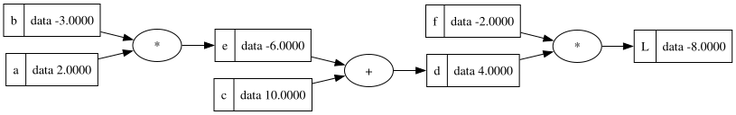
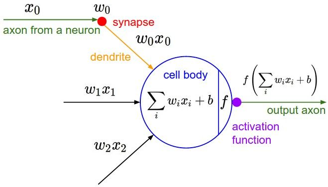
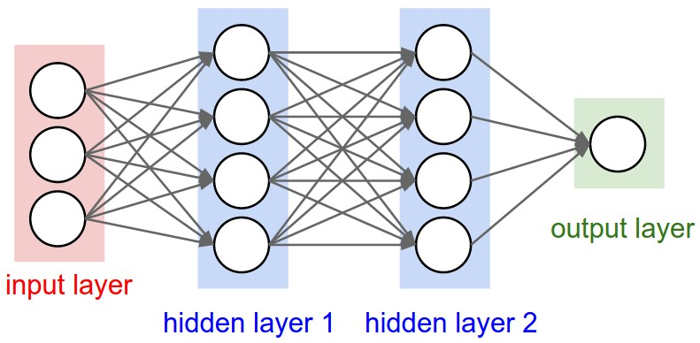
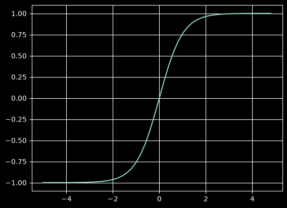

## 개요
Micrograd란 Autograd(Automatic Differentiation) 즉 자동 미분 엔진으로 Backpropagation(역전파) 알고리즘을 구현한 것
(Karpathy는 영상에서 "automatic gradient"라고 불렀지만 일반적으로 통용되는 표기는 automatic differentiation이다.)

Backpropagation(역전파)는 손실 함수를 가중치로 미분한 기울기를 효율적으로 계산할 수 있도록 해주는 알고리즘이다.

신경망의 가중치를 반복적으로 조정하여 손실 함수를 최소화하여 네트워크의 정확도를 향상시킬 수 있다.


## 알고 가야하는 내용
1. 미분: 한 변수에서의 기울기.
2. 편미분: 여러 변수 중 하나에 대한 기울기.
3. Gradient(기울기): 모든 편미분을 모아 놓은 벡터.
4. Backpropagation(역전파): 연쇄법칙(Chain Rule)을 이용해 출력에서 입력 방향으로 모든 편미분을 효율적으로 계산하는 알고리즘.


## Micrograd에서 grad란?
최종 결과(output)가 이 변수에 얼마나 민감한가

loss = xy에서
x.grad = y
y.grad = x
가 된다.

print(f'{a.grad:.4f}') # prints 138.8338, i.e. the numerical value of dg/da 즉 a의 증가 기울기는 138
print(f'{b.grad:.4f}') # prints 645.5773, i.e. the numerical value of dg/db 즉 b의 증가 기울기는 645


## 미분
$$L = \lim_{h \to 0} \frac{f(x+h) - f(x)}{h}$$

x를 아주 작은 h만큼 증가시켰을 때 함수가 얼마나 반응하는지를 h로 나눠, h와 무관한 값(변화율)으로 만드는 것. h → 0 극한을 취해야 그 값이 하나로 확정된다.


## Value
신경망은 상당히 방대한 수학적 표현식을 다루기 때문에 이러한 표현식을 유지할 데이터 구조가 필요하다.
Value 클래스는 하나의 스칼라 값을 래핑하고 추적한다.

```python
class Value:

    def __init__(self, data):
        self.data = data

    def __repr__(self):
        return f"Value(data={self.data})"
```

`__init__`은 객체가 만들어질 때 자동으로 불린다. 넘어온 `data`는 함수가 끝나면
사라지므로, `self.data`에 담아 객체가 살아있는 동안 보존한다.

`__repr__`이 없으면 객체를 출력했을 때 `<__main__.Value object at 0x104f2a3d0>`처럼
메모리 주소만 나온다. 앞으로 Value를 수십 개 만들어 더하고 곱할 텐데 그 상태로는
디버깅이 불가능하다. 그래서 값을 저장하는 것만으로 부족하고 출력 형식까지 정의한다.

1. 객체에 대한 덧셈 연산자
```python
def __add__(self, other):
    out = Value(self.data + other.data)
    return out
```
덧셈 연산자 실행시 파이썬은 내부적으로 a.__add__(b)를 실행한다.

2. 객체에 대한 곱셈 연산자
```python
def __mul__(self, other):
    out = Value(self.data * other.data)
    return out
```
곱셈 연산자 실행시 파이썬은 내부적으로 a.__mul__(b)를 실행한다.

표현식을 연결하는 부분이 필요하다. 즉 어떤 값이 어떤 값을 생성하는지 알고 있어야 한다. 따라서 children이라는 새로운 변수를 사용한다.
```python
class Value:

    def __init__(self, data, _children=()):
        self.data = data
        self._prev = set(_children)

    def __repr__(self):
        return f"Value(data={self.data})"
```
튜플이지만 클래스에서 관리할 때는 집합으로 처리(효율성을 위해)

덧셈이나 곱셈을 통해 값을 만들 때는 해당 값의 자식들을 전달해야 한다.
```python
    def __add__(self, other):
        out = Value(self.data + other.data, (self, other))
        return out
    
    def __mul__(self, other):
        out = Value(self.data * other.data, (self, other))
        return out
```

이제 모든 값의 자식은 알지만, 그 값이 어떤 연산으로 만들어졌는지는 알 수 없다.
덧셈으로 나온 4인지 곱셈으로 나온 4인지 구분이 안 된다. 그래서 `_op`를 추가한다.

`_children=()`와 `_op=''`는 둘 다 기본값이 "비어 있음"이다. a, b, c, f처럼 내가 직접
만든 값(리프 노드)은 자식도 없고 생성 연산도 없으므로 아무것도 넘기지 않는다.
반대로 `_op`가 비어 있지 않다는 건 그 노드가 계산으로 생겨났다는 뜻이다.
```python
class Value:
    
    def __init__(self, data, _children=(), _op=''):
        self.data = data
        self._prev = set(_children)
        self._op=_op
    
    def __repr__(self):
        return f"Value(data={self.data})"
    
    def __add__(self, other):
        out = Value(self.data + other.data, (self, other),'+')
        return out
    
    def __mul__(self, other):
        out = Value(self.data * other.data, (self, other), '*')
        return out
```

이제 완전한 수학적 표현식을 갖게 되었다. 이를 통해 각 값이 어떻게 생성되었는지 다른 값들로부터 어떻게 생성되었는지 정확하게 알 수 있다.

```python
a = Value(2.0)
b = Value(-3.0)
c = Value(10.0)
d = a * b + c
```

```python
d._prev
```
결과: {Value(data=-6.0), Value(data=10.0)}

```python
d._op
```
결과: '+'


그래프를 그려보면 노드에 숫자만 나와서 어느 게 a고 어느 게 b인지 구분이 안 된다.
사람이 읽을 이름표가 필요하므로 `label`을 추가한다.
```python
class Value:
    
    def __init__(self, data, _children=(), _op='', label=''):
        self.data = data
        self._prev = set(_children)
        self._op=_op
        self.label = label
    
    def __repr__(self):
        return f"Value(data={self.data})"
    
    def __add__(self, other):
        out = Value(self.data + other.data, (self, other),'+')
        return out
    
    def __mul__(self, other):
        out = Value(self.data * other.data, (self, other), '*')
        return out

a = Value(2.0,label='a')
b = Value(-3.0,label='b')
c = Value(10.0,label='c')
e = a * b; e.label = 'e'
d = e + c; d.label = 'd'
f = Value(-2.0,label='f')
L = d * f; L.label='L'
```

이 표현식을 그림으로 그려주는 `draw_dot` 함수. `trace`가 그래프를 훑으며 노드와 간선을
모으고, `draw_dot`이 그걸 graphviz로 그린다.

```python
from graphviz import Digraph

def trace(root):
  # builds a set of all nodes and edges in a graph
  nodes, edges = set(), set()
  def build(v):
    if v not in nodes:
      nodes.add(v)
      for child in v._prev:
        edges.add((child, v))
        build(child)
  build(root)
  return nodes, edges

def draw_dot(root):
  dot = Digraph(format='svg', graph_attr={'rankdir': 'LR'}) # LR = left to right

  nodes, edges = trace(root)
  for n in nodes:
    uid = str(id(n))
    # for any value in the graph, create a rectangular ('record') node for it
    dot.node(name = uid, label = "{ %s | data %.4f }" % (n.label,n.data), shape='record')
    if n._op:
      # if this value is a result of some operation, create an op node for it
      dot.node(name = uid + n._op, label = n._op)
      # and connect this node to it
      dot.edge(uid + n._op, uid)

  for n1, n2 in edges:
    # connect n1 to the op node of n2
    dot.edge(str(id(n1)), str(id(n2)) + n2._op)

  return dot

draw_dot(L)
```



여기까지가 **순방향 전달(forward pass)** 이다. 리프 노드에서 시작해 L을 계산했다.

역전파는 반대 방향으로 가면서 각 노드마다 `dL/d노드`를 구한다.
분자는 항상 최종 출력 L로 고정이고, 분모만 노드별로 바뀐다.

신경망에서는 손실 함수 L을 가중치에 대해 미분하는 것이 중요하다.
리프 노드 중 일부는 **가중치**(조절 대상)가 되고, 나머지는 **입력 데이터**가 된다.
가중치가 손실 함수에 어떤 영향을 미치는지 알아야 조절할 수 있기 때문이다.

---

## grad

### 노드의 종류

```
          L          ← 루트 (root)
         / \
        d   f
       / \
      e   c
     / \
    a   b            ← 리프 (leaf)
```

| 종류 | 노드 | 설명 |
|---|---|---|
| 리프 | a, b, c, f | 자식 없음. 내가 직접 만든 값. 신경망의 가중치/데이터 |
| 중간 | e, d | 계산으로 생김 |
| 루트 | L | 맨 위. 신경망에서는 loss |

코드에서는 `_prev`로 구분한다.

```python
a._prev   # set()      → 비어 있음 = 리프
d._prev   # {e, c}     → 자식 있음 = 계산으로 생김
```

우리가 원하는 것은 **리프 노드의 grad**다. 조절할 수 있는 게 그것뿐이기 때문이다.

> **grad = 이 노드가 변하면 L이 얼마나 변하는가**
> `d.grad`는 `dL/dd`, 즉 L을 d로 미분한 값이다.

### Value에 grad 추가

```python
class Value:
    
    def __init__(self, data, _children=(), _op='', label=''):
        self.data = data
        self.grad = 0.0
        self._prev = set(_children)
        self._op=_op
        self.label = label
    
    def __repr__(self):
        return f"Value(data={self.data})"
    
    def __add__(self, other):
        out = Value(self.data + other.data, (self, other),'+')
        return out
    
    def __mul__(self, other):
        out = Value(self.data * other.data, (self, other), '*')
        return out
```
`grad`의 초기값이 0인 이유 → 아직 아무것도 계산하지 않은 상태에서는
"이 값이 출력에 영향을 주지 않는다"고 가정하는 것이 안전하기 때문.

### 곱셈 노드: dL/dd

```
L = d * f

((d+h)*f - d*f) / h
= (d*f + h*f - d*f) / h
= f
```

즉 `d.grad` = L을 d로 미분한 값 = `f` = **-2**

같은 계산을 f에 대해 하면 `f.grad` = `d` = **4**.
곱셈 노드에서는 **짝꿍의 값**이 답이다.

L의 바로 아래 두 노드가 가장 중요하다. 이 둘의 기울기를 이해하면
역전파 전체와 신경망 학습 전체를 이해할 수 있기 때문이다.

### 덧셈 노드: dL/dc

c는 L과 직접 붙어 있지 않다. `c → d → L`로 한 다리 건너 있다.

- 알고 있는 것: `dL/dd` (L이 d에 얼마나 민감한지)
- 필요한 것: `dd/dc` (c가 d에 미치는 영향)

이 둘을 합치면 c가 L에 미치는 영향을 알 수 있다.

```
d = c + e

((c+h) + e - (c + e)) / h
= (c + h + e - c - e) / h
= 1
```

따라서 `dd/dc = 1.0`, `dd/de = 1.0`.

### 연쇄 법칙

- 원하는 것: `dL/dc`
- 알고 있는 것: `dL/dd`, `dd/dc`

```
dL/dc = (dL/dd) × (dd/dc)
      = (-2)    × (1)
      = -2
```

덧셈 노드는 국소 미분값이 1이므로 **기울기를 그대로 전달**한다.
받은 grad를 자식들에게 복사해 나눠줄 뿐 값을 바꾸지 않는다.

a, b도 같은 방식이다. `e = a * b`이므로 곱셈 규칙을 적용한다.

```
a.grad = e.grad × b = (-2) × (-3) =  6
b.grad = e.grad × a = (-2) × ( 2) = -4
```

### 정리

| 노드 | 자식에게 넘길 때 |
|---|---|
| `+` | 그대로 (×1) |
| `*` | 짝꿍의 값을 곱해서 |

L에서 시작해 규칙대로 내려오면 모든 grad가 채워진다.

```
L.grad = 1
d.grad = 1  × f = -2      f.grad = 1 × d =  4
e.grad = -2 × 1 = -2      c.grad = -2 × 1 = -2
a.grad = -2 × b =  6      b.grad = -2 × a = -4
```

역전파 신호는 그래프를 **거꾸로 흐른다**. 모든 중간 노드에 대한 L의 미분값이
루트에서 리프 방향으로 전달된다.

여기까지가 수동 역전파다. 모든 노드를 하나씩 순회하며 연쇄 법칙을 적용했고,
국소 미분값을 재귀적으로 곱해 나갔다.

> **역전파: 계산 그래프를 따라 역방향으로 연쇄 법칙을 재귀적으로 적용하는 것**

## 최적화 한 스텝 (single optimization step)

```python
a.data += 0.01 * a.grad
b.data += 0.01 * b.grad
c.data += 0.01 * c.grad
f.data += 0.01 * f.grad

e = a * b
d = e + c
L = d * f
```

0.01은 learning rate. 한 번에 얼마나 움직일지 정한다.
grad 방향으로 밀면 L이 실제로 움직인다.

---

## 복잡한 예제를 사용한 수동 역전파 구현

이번에는 뉴런을 통해 역전파를 수행한다.
신경망을 구축할 때 가장 간단한 방식을 **다층 퍼셉트론(Multi-Layer Perceptron, MLP)** 이라고 한다.

뉴런에는 입력 축삭(axon)이 있고 가중치가 있는 시냅스가 있다. w는 가중치를 의미한다.
시냅스는 뉴런의 입력과 곱셈적으로 상호작용한다. 따라서 세포체로 흐르는 것은 `w * x`이다.
이때 여러 입력이 있기 때문에 세포체로 흐르는 `w * x`도 여러 개이다.

세포체에는 바이어스(bias) 또한 있다. 바이어스는 뉴런의 내재적인 활성화 성향 같은 것으로,
입력과 관계없이 더 활성화하거나 덜 활성화할 수 있다.


*출처: Karpathy, Neural Networks: Zero to Hero 1강*


*출처: 위와 같음*

기본적으로 모든 입력의 `w * x` 값에 바이어스를 더한 다음 활성화 함수를 통과시킨다.
활성화 함수는 보통 시그모이드나 **tanh** 같은 압축(squashing) 함수이다.

```python
plt.plot(np.arange(-5,5,0.2),np.tanh(np.arange(-5,5,0.2))); plt.grid();
```


입력값이 들어오면 y 좌표에서 압축되는 걸 확인할 수 있다.
즉 큰 양수 입력값을 주면 1로 부드럽게 제한되고, 음수 입력값을 주면 -1로 부드럽게 제한된다.

이것이 활성화 함수 또는 압축 함수의 역할이다. 이 뉴런에서 나오는 값은
가중치와 입력값의 내적에 활성화 함수를 적용한 값이다.

## 직접 해볼 것
- [ ] PyTorch 그래디언트와 대조 검증
- [ ] 연산자 확장 (exp, log)
- [ ] 의도적 버그 주입 실험 (grad를 `=`로 덮어쓰면 뭐가 깨지나)
- [ ] `d = a + a`일 때 `_prev`가 set이라 `{a}` 하나가 되는데 역전파에서 문제 없나?